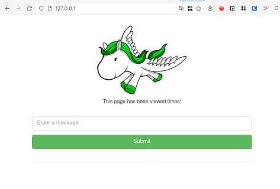

# Ambiente utilizado para os testes:

- Docker versão 20.10.14
- Docker Compose 1.29.2

# Como testar:
- Clonar repositório.

- Executar o comando "docker-compose up" dentro da pasta do repositório que foi clonado.

- Acessar o endereço http://127.0.0.1 pelo navegador e ver se a página é exibida corretamente, conforme o exemplo abaixo:

------------------------------------------------------------------------------
# Comentários:

- Requisito 1,2 e 3: tudo conforme o esperado.

- Requisito 4: fiz um teste simples de verificação sintaxe no arquivo manage.py toda vez que é feito um push ou pull request no main. Esse mesmo teste poderia ser estendido a outros arquivos.

- Requisito 5,6 e 7: tudo certo.

- Requisito extra: Infelizmente não consegui executar, sei que é possível fazer usando a AWS por exemplo puxando os arquivos diretamente no repositório no GitHub.
